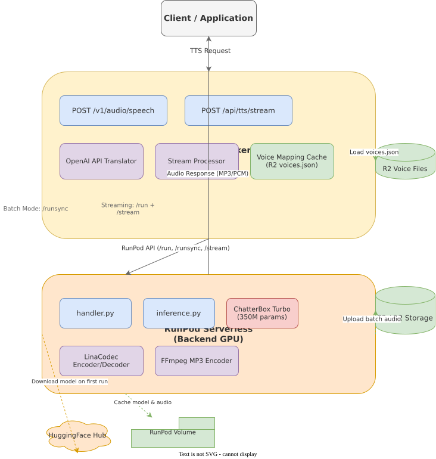
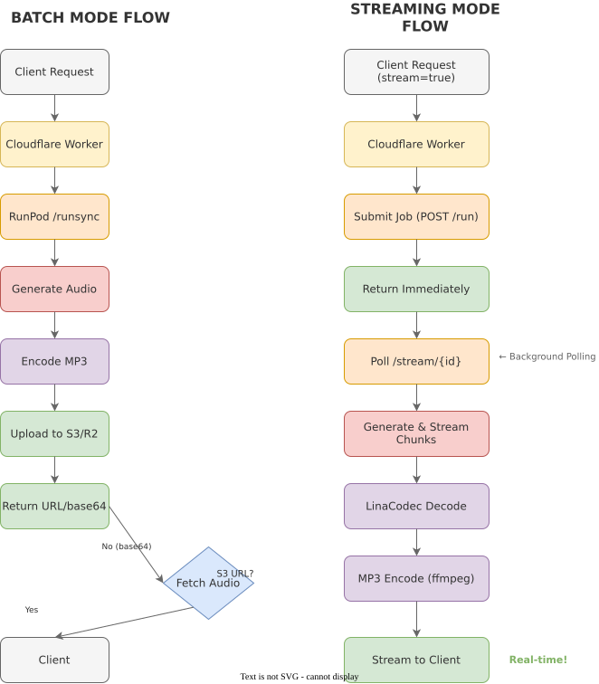

# ChatterBox RunPod Serverless

> A high-performance, OpenAI-compatible Text-to-Speech API built on Resemble AI's ChatterBox Turbo model, deployed on RunPod Serverless with a Cloudflare Worker middleware tier.

## Features

- **OpenAI API Compatible**: Drop-in replacement for OpenAI's TTS API (`/v1/audio/speech`)
- **Ultra-Low Latency Streaming**: Real-time audio streaming with MP3/PCM output formats
- **Zero-Shot Voice Cloning**: Clone any voice from a short audio sample (3-30 seconds)
- **Multi-Language Support**: 23+ languages supported
- **Dual Operation Modes**:
  - **Batch Mode**: Fast synchronous generation using `/runsync`
  - **Streaming Mode**: Real-time chunk streaming with minimal TTFB
- **Smart Audio Processing**: LinaCodec compression for internal transfer, FFmpeg for final encoding
- **Scalable Architecture**: Serverless GPU backend with edge caching middleware

## Architecture



ChatterBox uses a three-tier architecture:

1. **Tier 1 (Client)**: Any application using OpenAI's TTS API
2. **Tier 2 (Middleware)**: Cloudflare Worker providing OpenAI compatibility and request routing
3. **Tier 3 (Backend)**: RunPod Serverless GPU running ChatterBox Turbo model

### Data Flow



**Batch Mode** (`stream=false`):
- Uses RunPod `/runsync` for fast synchronous execution
- Generates complete audio, encodes to MP3, uploads to S3/R2
- Returns presigned URL or base64-encoded audio

**Streaming Mode** (`stream=true`):
- Submits job via `/run`, returns immediately
- Polls `/stream/{id}` endpoint in background
- Decodes LinaCodec chunks, encodes to MP3/PCM
- Pipes audio chunks to client in real-time

## Quick Start

### Prerequisites

- RunPod account with GPU serverless enabled
- Cloudflare account (for Worker deployment)
- HuggingFace token (for model download)
- Optional: S3/R2 compatible storage for batch mode

### Backend Deployment (RunPod)

1. **Connect GitHub Repository** to RunPod Serverless
2. **Configure Template**:
   - **Container Image**: `runpod/base:0.4.0-cuda11.8.0` (or similar CUDA base)
   - **Start Command**: `bash bootstrap.sh`
3. **Set Environment Variables**:
   ```bash
   HF_TOKEN=your_huggingface_token
   S3_ENDPOINT_URL=your_s3_endpoint        # Optional
   S3_ACCESS_KEY_ID=your_access_key        # Optional
   S3_SECRET_ACCESS_KEY=your_secret_key    # Optional
   S3_BUCKET_NAME=your_bucket_name         # Optional
   S3_REGION=us-east-1                     # Optional
   ```

4. **Deploy**: Push to your `main` branch (RunPod auto-builds on commit)

### Middleware Deployment (Cloudflare)

1. **Install Dependencies**:
   ```bash
   cd bridge
   npm install
   ```

2. **Configure `wrangler.toml`**:
   ```toml
   name = "chatterbox-worker"
   main = "worker.js"
   compatibility_date = "2024-01-01"

   [vars]
   RUNPOD_URL = "https://api.runpod.ai/v2/YOUR_POD_ID/runsync"

   [[r2_buckets]]
   binding = "CHATTERBOX_BUCKET"
   bucket_name = "your-r2-bucket"
   ```

3. **Set Secrets**:
   ```bash
   npx wrangler secret put RUNPOD_API_KEY
   npx wrangler secret put AUTH_TOKEN  # Optional: for API authentication
   ```

4. **Deploy**:
   ```bash
   npx wrangler deploy
   ```

### Configure Voice Cloning

Upload reference audio files to your R2 bucket and create `voices.json`:

```json
{
  "alloy": "voices/alice_reference.ogg",
  "echo": "voices/bob_sample.wav",
  "fable": "voices/custom_voice.mp3"
}
```

**Audio Requirements**:
- Format: OGG, WAV, MP3, FLAC, M4A
- Duration: 3-30 seconds
- Quality: Clear speech, minimal background noise

## Usage

### OpenAI Compatible Endpoint

**Endpoint**: `POST https://your-worker.workers.dev/v1/audio/speech`

**Headers**:
```
Authorization: Bearer YOUR_AUTH_TOKEN  # Optional
Content-Type: application/json
```

#### Streaming Request (Recommended for Low Latency)

```bash
curl -X POST https://your-worker.workers.dev/v1/audio/speech \
  -H "Authorization: Bearer YOUR_TOKEN" \
  -H "Content-Type: application/json" \
  -d '{
    "model": "tts-1",
    "input": "Hello! This is a streaming text-to-speech test.",
    "voice": "alloy",
    "stream": true,
    "response_format": "mp3"
  }' --output output.mp3
```

**Python SDK Example**:
```python
from openai import OpenAI

client = OpenAI(
    base_url="https://your-worker.workers.dev/v1",
    api_key="your-auth-token"
)

response = client.audio.speech.create(
    model="tts-1",
    voice="alloy",
    input="Hello! This is a test.",
    stream=True
)

response.stream_to_file("output.mp3")
```

#### Batch Request

```bash
curl -X POST https://your-worker.workers.dev/v1/audio/speech \
  -H "Content-Type: application/json" \
  -d '{
    "model": "tts-1",
    "input": "This is a batch request for complete audio generation.",
    "voice": "echo",
    "response_format": "mp3"
  }' --output batch.mp3
```

### Direct Streaming Endpoint

**Endpoint**: `POST https://your-worker.workers.dev/api/tts/stream`

For advanced use cases requiring Server-Sent Events (SSE):

```bash
curl -X POST https://your-worker.workers.dev/api/tts/stream \
  -H "Content-Type: application/json" \
  -d '{
    "text": "Stream this text via SSE",
    "voice": "alloy",
    "output_format": "mp3"
  }'
```

## API Reference

### OpenAI TTS API Parameters

| Parameter | Type | Required | Default | Description |
|-----------|------|----------|---------|-------------|
| `model` | string | Yes | - | Must be `"tts-1"` (for compatibility) |
| `input` | string | Yes | - | Text to synthesize (max 2000 chars) |
| `voice` | string | Yes | - | Voice name from `voices.json` mapping |
| `response_format` | string | No | `mp3` | Output format: `mp3` or `pcm` |
| `stream` | boolean | No | `false` | Enable streaming mode |
| `speed` | number | No | `1.0` | Ignored (for OpenAI compatibility) |

### Direct Streaming Parameters

| Parameter | Type | Required | Default | Description |
|-----------|------|----------|---------|-------------|
| `text` | string | Yes | - | Text to synthesize |
| `voice` | string | Yes | - | Voice name from `voices.json` |
| `output_format` | string | No | `mp3` | Format: `mp3` or `pcm_16` |
| `service` | string | No | `chatterbox` | Service identifier |

### Backend Generation Parameters

Advanced parameters passed to ChatterBox model:

| Parameter | Type | Range | Default | Description |
|-----------|------|-------|---------|-------------|
| `temperature` | float | 0.05-2.0 | 0.8 | Sampling temperature |
| `top_p` | float | 0.0-1.0 | 0.95 | Nucleus sampling threshold |
| `top_k` | int | 0-1000 | 1000 | Top-k sampling |
| `repetition_penalty` | float | 1.0-2.0 | 1.2 | Repetition penalty |
| `min_p` | float | 0.0-1.0 | 0.0 | Minimum probability |
| `norm_loudness` | boolean | - | true | Normalize to -27 LUFS |

## Configuration

### RunPod Environment Variables

| Variable | Required | Description |
|----------|----------|-------------|
| `HF_TOKEN` | Yes | HuggingFace authentication token |
| `HF_HOME` | No | HF cache directory (default: `/runpod-volume/chatterbox/hf_home`) |
| `HF_HUB_CACHE` | No | HF hub cache (default: `/runpod-volume/chatterbox/hf_cache`) |
| `S3_ENDPOINT_URL` | No | S3-compatible endpoint |
| `S3_ACCESS_KEY_ID` | No | S3 access key |
| `S3_SECRET_ACCESS_KEY` | No | S3 secret key |
| `S3_BUCKET_NAME` | No | S3 bucket name |
| `S3_REGION` | No | S3 region (default: `us-east-1`) |
| `MAX_TEXT_LENGTH` | No | Max text length (default: `2000`) |
| `MAX_CHUNK_CHARS` | No | Max chars per chunk (default: `300`) |

### Cloudflare Worker Configuration

| Variable | Required | Description |
|----------|----------|-------------|
| `RUNPOD_URL` | Yes | RunPod endpoint URL |
| `RUNPOD_API_KEY` | Yes | RunPod API key (secret) |
| `AUTH_TOKEN` | No | Bearer token for client auth (secret) |
| `CHATTERBOX_BUCKET` | Yes | R2 bucket binding |

## Project Structure

```
chatterbox/
├── handler.py           # RunPod serverless entry point
├── inference.py         # Model loading and inference pipeline
├── config.py            # Configuration management
├── bootstrap.sh         # Runtime bootstrap script
├── Dockerfile           # Container definition
├── requirements.txt     # Python dependencies
├── bridge/              # Cloudflare Worker middleware
│   ├── worker.js        # OpenAI API translator
│   ├── wrangler.toml    # Worker configuration
│   └── voices.json      # Voice name mappings
├── docs/
│   └── diagrams/        # Architecture diagrams
└── echo-tts/            # Reference implementation
```

## Development

### Running Tests

Tests must run inside the container environment:

```bash
# Copy test script to container
docker cp test_script.py echotts-openai:/app/

# Run test in container
docker exec echotts-openai python3 /app/test_script.py
```

### Local Development

For local testing, use the Flask development server:

```bash
python app.py
```

Then test with:
```bash
curl -X POST http://localhost:5000/v1/audio/speech \
  -H "Content-Type: application/json" \
  -d '{"text": "Hello world", "voice": "alloy"}'
```

## Key Implementation Details

### Generator Pattern

The handler must be a Python generator to support RunPod's streaming:

```python
def handler(job):
    stream = job.get("input", {}).get("stream", False)

    if stream:
        yield from handler_stream(job_input)
    else:
        yield handler_batch(job)

# Critical: Enable aggregate stream for /runsync
runpod.serverless.start({
    "handler": handler,
    "return_aggregate_stream": True  # Required!
})
```

### LinaCodec Integration

LinaCodec provides efficient internal compression:

```python
from linacodec.codec import LinaCodec

# Encode audio to tokens (auto-upsamples to 48kHz)
tokens, embedding = lina.encode(audio_tensor)

# Decode tokens back to audio
audio_tensor = lina.decode(tokens, embedding)
```

### MP3 Encoding with FFmpeg

On-the-fly MP3 encoding for reduced bandwidth:

```python
subprocess.Popen([
    'ffmpeg', '-y',
    '-f', 's16le',
    '-ar', str(sample_rate),
    '-ac', '1',
    '-i', 'pipe:0',
    '-f', 'mp3',
    '-b:a', '192k',
    'pipe:1'
], stdin=subprocess.PIPE, stdout=subprocess.PIPE)
```

### RunPod Endpoints

- **`/runsync`**: Synchronous execution, waits for completion (batch mode)
- **`/run`**: Async submission, returns job ID immediately (streaming)
- **`/stream/{id}`**: Poll for streaming output chunks

## Troubleshooting

### Common Issues

**"Too many subrequests" in Cloudflare Worker**
- Use `/runsync` for batch mode instead of polling `/status`
- Implement exponential backoff when polling is necessary

**Empty output from `/runsync`**
- Ensure `return_aggregate_stream=True` in `runpod.serverless.start()`
- Handler must be a generator (use `yield`)

**LinaCodec import errors**
- Install with: `pip install linacodec`
- Verify HF_HOME is set to network volume path

**Memory errors on large texts**
- Reduce `MAX_CHUNK_CHARS` (default: 300)
- Implement text chunking for long-form content

### Debug Mode

Enable verbose logging:

```python
import logging
logging.basicConfig(level=logging.DEBUG)
```

## Performance Optimization

1. **Use streaming mode** for real-time applications
2. **Enable S3/R2 storage** for batch mode to reduce response size
3. **Cache voice mappings** in Cloudflare Worker (5-minute TTL)
4. **Use `/runsync`** for batch jobs under 60 seconds
5. **Set appropriate chunk sizes** for your use case

## License

MIT License - see [LICENSE](LICENSE) for details.

Based on Resemble AI's [ChatterBox](https://github.com/resemble-ai/chatterbox) project.

## Acknowledgments

- **Resemble AI** for the ChatterBox Turbo model
- **RunPod** for serverless GPU infrastructure
- **Cloudflare** for Workers and R2 storage
- **OpenAI** for the TTS API specification
